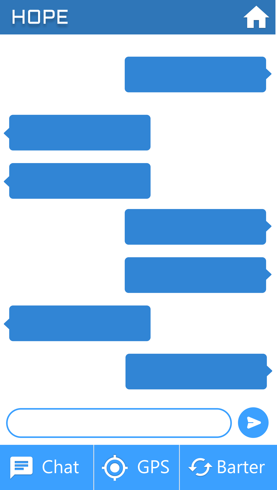
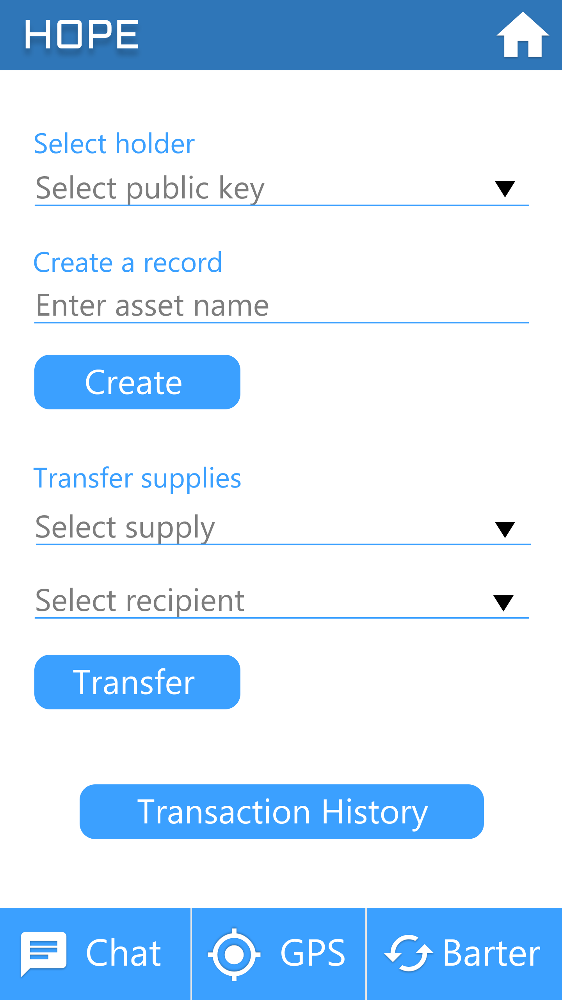

## H.O.P.E

Help-Other-People-in-Emergency
SOS tool for disaster relief

---

<br/>


<br/>
<br/>


### An application to acheive the following:

<br/>

 - [X] Internet-less chat
 - [X] Alert broadcasting 
 - [X] location sharing
 - [X] charity supply chain tracking using blockchain
 - [X] barter using blockchain

<br/>
<br/>






<br />
<br />


### Open port list and functionality

| PORT  |   FUNCTIONALITY | ROUTE |
|---|---|---|
| 80 | Chatroom and location sharing | / |
| 80 | Alert broadcasting and location handler | /admin |
| 8008 | Sawtooth rest-api | - |
| 8000 | blockchain client | - |
| 4000 | chain validator | - |


<br />
<br />

### How to run

<br />

To run containers

```bash
$ git clone https://github.com/angadsharma1016/hope.git
$ cd hope/project
$ docker-compose up

```

