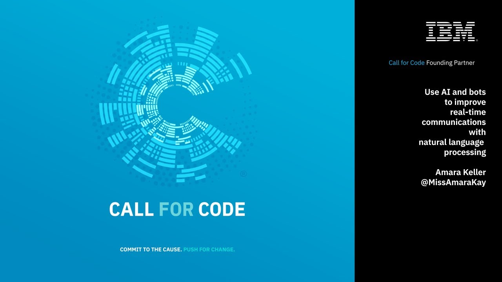

## IBM'S CALL FOR CODE
---

 

 
 

### An application to acheive the following:

 

 - [X] Internet-less chat
 - [X] Alert broadcasting 
 - [X] location sharing
 - [X] charity supply chain tracking using blockchain
 - [X] barter using blockchain
 - [X] automatic deployment server

 
 

### Open ports and functionality

| PORT  |   FUNCTIONALITY | ROUTE |
|---|---|---|
| 80 | Chatroom and location sharing | / |
| 80 | Alert broadcasting and location handler | /admin |
| 8008 | Sawtooth rest-api | - |
| 8000 | blockchain client | - |
| 4000 | chain validator | - |
| 6666 | automated deployment node server | POST /webhook/github | 
